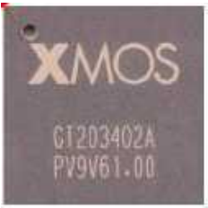

# ReSpeaker USB 4 Mic Array

>Available at [Seeed](https://www.seeedstudio.com/ReSpeaker-Mic-Array-v2.0-p-3053.html)


The ReSpeaker USB 4 Mic Array is the successor of the ReSpeaker USB 6+1 Mic Array. It has better built-in audio processing algorithms than the 6+1 Mic Array, so it has better audio recording quality, although it only has 4 microphones.

## Features
+ 4 microphones
+ 12 RGB LEDs
+ USB
+ built-in AEC, VAD, DOA, Beamforming and NS
+ 16000 sample rate

## Usage
[Audacity](https://www.audacityteam.org/) is recommended to test audio recording.

## Install DFU and LED control driver for Windows
On Linux and macOS, the USB 4 Mic Array will just work. On Windows, audio recording and playback will also work without installing a driver. But in order to upgrade the device's firmware or to control LEDs an DSP parameters on Windows, the libusb-win32 driver is required. We use [a handy tool - Zadig](https://zadig.akeo.ie/) to install the libusb-win32 driver for both `SEEED DFU` and `SEEED Control` (the USB 4 Mic Array has 4 devices on Windows Device Manager).


>Make sure that libusb-win32 is selected, not WinUSB or libusbK

## Device Firmware Update
The Microphone Array supports USB DFU. We have [a python script - dfu.py](https://github.com/respeaker/mic_array_dfu/blob/master/dfu.py) to do that.

```
pip install pyusb
python dfu.py --download new_firmware.bin       #  with sudo if usb permission error
```

| firmware | channels | note |
|---------------------------------|----------|-----------------------------------------------------------------------------------------------|
| 1_channel_firmware.bin | 1 | processed audio for ASR |
| 6_channels_firmware.bin | 6 | channel 0: processed audio for ASR, channel 1-4: 4 microphones' raw data, channel 5: playback |


>**Note: The flash memory of XVF3000 has updated from 90nm to 65nm, the Jedec ID between the 90nm and 65nm flash memories has a 1-bit different. This will cause the new device not upgradable after you download old firmware(v2.0.0 or below) to an new device. The new firmware(v3.0.0 or above) is already compatible with old device and new device, so we advise customers to use the new firmware when DFU. The new 65nm flash memory device will use new part numbers with a suffix 'A' as the following picture:**



### Summary of programming and dfu scenarios:

|  | hardware | factory programmed | DFU firmware | outcome |
| :-----| :-----| :-----| :-----| :-----| 
| 1 | old device | any | any | DFU succeed, device operates correctly and upgradeable  | 
| 2 | new device (XVF3000 with a suffix 'A') | 3.0.0 | 3.0.0 or above | DFU succeed, device operates correctly and upgradeable | 
| 3 | new device (XVF3000 with a suffix 'A') | 3.0.0 | 2.0.0 or below | DFU succeed, device operates correctly, but **not upgradeable**  | 

## How to control the RGB LED ring
The USB 4 Mic Array has on-board 12 RGB LEDs and has a variety of light effects. Go to the [respeaker/pixel_ring](https://github.com/respeaker/pixel_ring) to learn how to use it. The LED control protocol is at [respeaker/pixel_ring wiki](https://github.com/respeaker/pixel_ring/wiki/ReSpeaker-USB-4-Mic-Array-LED-Control-Protocol).


## Tuning
There are some parameters of built-in algorithms to configure. For example, we can turn off Automatic Gain Control (AGC):

```
python tuning.py AGCONOFF 0i6_firmware.bin
```

To get the full list parameters, run:

```
python tuning.py -p
```

## Realtime sound source localization and tracking
[ODAS](https://github.com/introlab/odas) is a very cool project to perform sound source localization, tracking, separation and post-filtering. Let's have a try!

1. get ODAS and build it

```
sudo apt-get install libfftw3-dev libconfig-dev libasound2-dev
git clone https://github.com/introlab/odas.git --branch=dev
mkdir odas/build
cd odas/build
cmake ..
make
```

2. get ODAS Studio from https://github.com/introlab/odas_web/releases and open it.

The `odascore` will be at `odas/bin/odascore`, the config file is at [odas.cfg](odas.cfg). Change `odas.cfg` based on your sound card number.


```
    interface: {
        type = "soundcard";
        card = 1;
        device = 0;
    }
```

3. upgrade your usb 4 mic array with [6_channels_firmware_6.02dB.bin](6_channels_firmware_6.02dB.bin) (or 6_channels_firmware.bin, 6_channels_firmware_12.04dB.bin) which includes 4 channels raw audio data.


